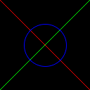
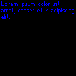

# ImageUtil

ImageUtil is a lightweight Ruby library focused on manipulating images directly in memory. Its primary goal is to help scripts visualize data right in the terminal by supporting SIXEL output alongside common image formats. The API is still evolving and should be considered unstable until version 1.0.

## Creating an Image

```ruby
require 'image_util'

# 40×40 RGBA image
img = ImageUtil::Image.new(40, 40)
```

An optional block receives pixel coordinates and should return something that can be converted to a color. Dimensions of more than two axes are supported.

```ruby
img = ImageUtil::Image.new(128, 128) { |x, y| ImageUtil::Color[x, y, 40] }
```


## Loading and Saving

Instead of building an image from scratch you can load one with
`ImageUtil::Image.from_string` or `ImageUtil::Image.from_file`.
Both helpers understand the built in codecs for `png`, `jpeg`, `pam`, `gif`
and `apng` formats:

```ruby
img = ImageUtil::Image.from_file("logo.png")
data = ImageUtil::Image.from_string(File.binread("logo.jpeg"))
```

A `from_file` method also supports passing IO objects:

```ruby
img = ImageUtil::Image.from_file(IO.popen("magick rose: png:"))
img.draw_line([0,0], [69,45], :blue)
```


The same formats can be written back using `to_string` or `to_file`.
When saving to a file path, `to_file` can infer the format from the file extension.

```ruby
img.to_file("out.png")
binary = img.to_string(:jpeg)
```

## Image Information

After loading or creating an image, you can access information about it, like
dimensions or color bits.

```ruby
img.dimensions # => [20,30]
img.width # => 20
img.height # => 30
img.color_bits # => 8 (means every channel has 8 bits of color)
img.channels # => 3 (RGB)
```

## Terminal Output

Images can be previewed in compatible terminals:

```ruby
puts ImageUtil::Terminal.output_image($stdin, $stdout, img)
```

In `irb` or `pry` the `inspect` method shows the image automatically, so you can
just evaluate the object:

```ruby
img
```

The library checks if the Kitty graphics protocol is available and falls back to SIXEL otherwise. Kitty graphics protocol is supported by Kitty, Konsole
and a couple others. SIXEL, most notably, works in Windows Terminal, Konsole (KDE), iTerm2 (macOS), XTerm (launch with: `xterm -ti vt340`). Here's how SIXEL
looks in Konsole:


This library supports generating Sixel with either `libsixel`, `ImageMagick` or using a pure-Ruby Sixel generator. For best performance, try to install one of
the earlier system packages. Both Kitty and SIXEL outputs also accept one-dimensional images, treating them as height `1`.


## Color Values

`ImageUtil::Color.from` (also known as `ImageUtil::Color.[]`) accepts several inputs:

- Another `Color` instance
- Arrays of numeric components (`[r, g, b]` or `[r, g, b, a]`)
- Numbers (used for all RGB channels)
- Symbols or strings containing CSS color names (`:rebeccapurple`, 'papayawhip')
- Hex strings like `'#abc'`, `'#aabbcc'` or `'#rrggbbaa'`

When numeric components are given, integers are first clamped to the `0..255`
range. Float values are treated as fractions of 255, so `0.5` becomes `127.5`
and `1.0` becomes `255`. After scaling, values are again clamped to this range.
If the alpha channel is omitted it defaults to `255`.

```ruby
ImageUtil::Color[0.5] # => #808080
ImageUtil::Color[:red] # => #ff0000
ImageUtil::Color["#fc0"] # => #ffcc00
```

Note that whenever the library expects a color, it may be given in any form accepted by this function.

## Pixel Access

Pixels can be accessed with integer coordinates or ranges. When ranges are used
a new `Image` containing that region is returned and can be modified separately.

```ruby
img[0, 0] = '#ff0000'
patch = img[0..1, 0..1]
```

For instance, you can extract a region, edit it and paste it back:

```ruby
img = ImageUtil::Image.new(128, 128) { [0, 0, 0] }
corner = img[0..32, 0..32]
corner.all = :green
img[0..32, 0..32] = corner
img[2, 2] = :yellow
# img.to_file("pixel_patch.png", :png)
img
```


Assigning an image to a range automatically resizes it to fit before pasting.

On the other hand, if you assign a color to a range, it will fill all referenced
pixels with that color (draw a rectangle).

Iteration helpers operate on arbitrary ranges and share the same syntax used
when indexing images.  `each_pixel` yields color objects, while
`each_pixel_location` yields coordinate arrays.  `set_each_pixel_by_location!`
assigns the value returned by the block to every location (unless `nil` is returned).

```ruby
# create an all-black image
img = ImageUtil::Image.new(128, 128) { :black }

# fill a checkerboard pattern
img.set_each_pixel_by_location! do |x, y|
  :red if (x + y).odd?
end

# count how many red pixels were set
black = img.each_pixel.count { |c| c == :red }

# display img in terminal
img
```


Note that instead of manually calling `set_each_pixel_by_location`, you can just pass a block to `ImageUtil::Image.new`.

## Filters

`ImageUtil::Image` ships with a few convenience filters. Each bang method
modifies the image in place while the non-bang version returns a copy.

### Background

Flatten an RGBA image on a solid color.

```ruby
# create a transparent image gradient containing shades of red only
img = ImageUtil::Image.new(128, 128) { |x, y| [255, 0, 0, x + y] }

# put it on a blue background
img.background([0, 0, 255])
```


### Paste

Place one image over another. When `respect_alpha` is true, the pasted pixels are
blended with the base image.

```ruby
base    = ImageUtil::Image.new(128, 128) { |x, y| [x, y, 50] }
overlay = ImageUtil::Image.new(64, 64)  { |x, y| [255, 0, 0, (x + y) * 2] }
base.paste!(overlay, 32, 32, respect_alpha: true)
```


### Draw

Draw simple shapes directly on the image.

```ruby
img = ImageUtil::Image.new(128, 128) { [0, 0, 0] }
img.draw_line!([0, 0], [127, 127], :red)
img.draw_line!([0, 127], [127, 0], :lime)
img.draw_circle!([64, 64], 30, :blue)
```



### Resize

Scale an image to new dimensions.

```ruby
img = ImageUtil::Image.new(128, 128) { |x, y| [x, y, 30] }
img[20, 20] = img.resize(64, 64)
img
```


### Palette

Reduce the image to a limited palette.

```ruby
img = ImageUtil::Image.new(128, 128) { |x, y| [x * 2, y * 2, 200] }
img.palette_reduce(64)
```


### Transform

Rotate or flip an image.

```ruby
img = ImageUtil::Image.new(128, 128) { |x, y| [x, y, 0] }
img.flip!(:x)
img.rotate!(90)
# img.rotate!(90, axes: [:x, :z])
```


### Colors

Multiply all pixels by a color.

```ruby
img = ImageUtil::Image.new(128, 128) { [255, 255, 255, 128] }
img * :red
```


### Bitmap Text

Overlay text using the bundled bitmap font.

```ruby
img = ImageUtil::Image.new(128, 128) { [0, 0, 0] }
img.bitmap_text!("Lorem ipsum dolor sit\namet, consectetur adipiscing\nelit.", 2, 2, color: :blue)
```



### Redimension

Change how many dimensions an image has or adjust their size.

```ruby
img = ImageUtil::Image.new(64, 64) { :white }
img.redimension!(128, 128) # can also add additional dimensions
img.background(:blue)
```


## Command Line

The gem includes a small `image_util` CLI. Run `image_util support` to list
available codecs, default format handlers and detected terminal features.
See [docs/cli.md](docs/cli.md) for details.

## Development

After checking out the repo, run `bin/setup` to install dependencies. Then run
`rake spec` to execute the tests. You can also run `bin/console` for an
interactive prompt for experimenting with the library.

### Benchmarking

Run `bin/benchmark` to execute a small benchmark.

## Contributing

Bug reports and pull requests are welcome on GitHub at
<https://github.com/rbutils/image_util>.

## License

The gem is available as open source under the terms of the
[MIT License](https://opensource.org/licenses/MIT).
