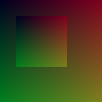

# ImageUtil

ImageUtil is a lightweight Ruby library focused on manipulating images directly in memory. Its primary goal is to help scripts visualize data right in the terminal by supporting SIXEL output alongside common image formats. The API is still evolving and should be considered unstable until version 1.0.

## Creating an Image

```ruby
require 'image_util'

# 40×40 RGBA image
img = ImageUtil::Image.new(40, 40)
```

An optional block receives pixel coordinates and should return something that can be converted to a color. Dimensions of more than two axes are supported.

```ruby
img = ImageUtil::Image.new(4, 4) { |x, y| ImageUtil::Color[x * 64, y * 64, 0] }
```

## Loading and Saving

Instead of building an image from scratch you can load one with
`ImageUtil::Image.from_string` or `ImageUtil::Image.from_file`.
Both helpers understand the built in codecs for `png`, `jpeg` and `pam`
formats:

```ruby
img = ImageUtil::Image.from_file("logo.png")
data = ImageUtil::Image.from_string(File.binread("logo.jpeg"))
```

The same formats can be written back using `to_string` or `to_file`.

```ruby
img.to_file("out.png", :png)
binary = img.to_string(:jpeg)
```

## Color Values

`ImageUtil::Color.from` accepts several inputs:

- Another `Color` instance
- Arrays of numeric components (`[r, g, b]` or `[r, g, b, a]`)
- Numbers (used for all RGB channels)
- Symbols or strings containing basic color names (`:red`, `'blue'`)
- Hex strings like `'#abc'`, `'#aabbcc'` or `'#rrggbbaa'`

When numeric components are given, integers are first clamped to the `0..255`
range. Float values are treated as fractions of 255, so `0.5` becomes `127.5`
and `1.0` becomes `255`. After scaling, values are again clamped to this range.
If the alpha channel is omitted it defaults to `255`.

Note that whenever the library expects a color, it may be given in any form accepted by this function (also available as `ImageUtil::Color[]`).

## Pixel Access

Pixels can be accessed with integer coordinates or ranges. When ranges are used
a new `Image` containing that region is returned and can be modified separately.

```ruby
img[0, 0] = '#ff0000'
patch = img[0..1, 0..1]
```

For instance, you can extract a region, edit it and paste it back:

```ruby
img = ImageUtil::Image.new(4, 4) { [0, 0, 0] }
corner = img[0..1, 0..1]
corner.all = :green
img[0..1, 0..1] = corner
img[2, 2] = :yellow
img.to_file("pixel_patch.png", :png)
```

Iteration helpers operate on arbitrary ranges:

```ruby
img.each_pixel { |pixel| puts pixel.inspect }
```

## Filters

`ImageUtil::Image` ships with a few convenience filters. Each bang method
modifies the image in place while the non-bang version returns a copy.

### Background

Flatten an RGBA image on a solid color.

```ruby
img = ImageUtil::Image.new(128, 128) { |x, y| [255, 0, 0, x + y] }
img.background([0, 0, 255])
```


### Paste

Place one image over another. When `respect_alpha` is true, the pasted pixels are
blended with the base image.

```ruby
base    = ImageUtil::Image.new(128, 128) { |x, y| [x, y, 50] }
overlay = ImageUtil::Image.new(64, 64)  { |x, y| [255, 0, 0, (x + y) * 2] }
base.paste!(overlay, 32, 32, respect_alpha: true)
```


### Draw

Draw simple shapes directly on the image.

```ruby
img = ImageUtil::Image.new(128, 128) { [0, 0, 0] }
img.draw_line!([0, 0], [127, 127], :red)
img.draw_line!([0, 127], [127, 0], :lime)
```


### Resize

Scale an image to new dimensions.

```ruby
i = ImageUtil::Image.new(256, 256) { |x, y| [x, y, 30] }
i[70, 70] = i.resize(64, 64); i
```



### Dither

Reduce the image to a limited palette.

```ruby
img = ImageUtil::Image.new(256, 64) { |x, y| [x, y * 4, 200] }
img.dither(8)
```


## SIXEL Output

Images can be previewed in compatible terminals:

```ruby
puts img.to_sixel
```

In `irb` or `pry` the `inspect` method shows the image automatically, so you can
just evaluate the object:

```ruby
img
```


## Development

After checking out the repo, run `bin/setup` to install dependencies. Then run
`rake spec` to execute the tests. You can also run `bin/console` for an
interactive prompt for experimenting with the library.

## Contributing

Bug reports and pull requests are welcome on GitHub at
<https://github.com/rbutils/image_util>.

## License

The gem is available as open source under the terms of the
[MIT License](https://opensource.org/licenses/MIT).
